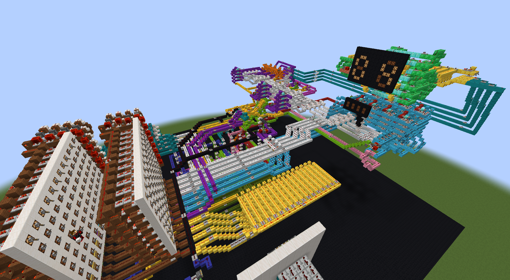
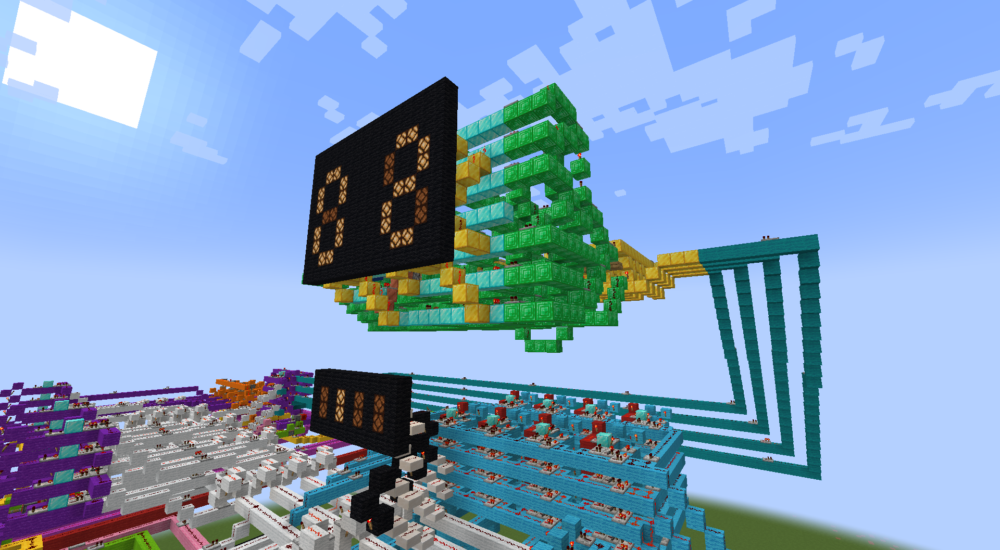
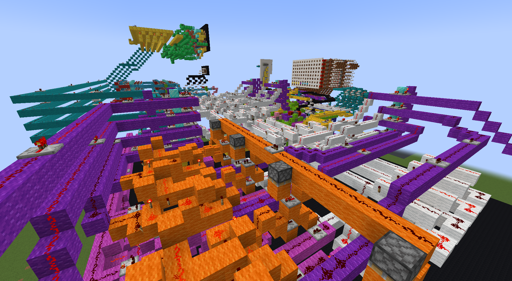
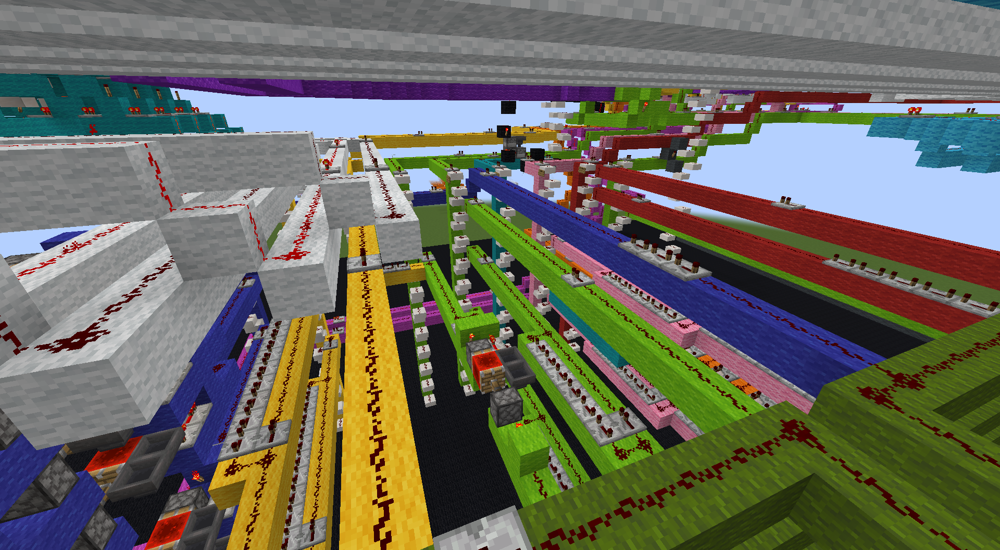

# Halvin
A (currently) 4 bit Minecraft computer.

## About
   
The Halvin is a 4 bit computer build using redstone in Minecraft. It provides a very basic instruction set, which includes simple arithmetic (addition and subtraction), RAM operations and conditional branching. 

  

## Parts
The PC has multiple parts which are also available separately. The following schematics are available:
- `parts/4bit_decoder` - A 4 bit decoder used in the instructions and the 7 segment display.
- `parts/7seg_dual_display` - A 7 segment dual digit display. Does not include decoder.
- `parts/ALU_comparator` - ALU capable of subtracting and adding two 4 numbers. The ALU is also able to compare two numbers for equality and whether one number is greater than the other.
- `parts/Bus_piece` - Piece of the bus used to connect all components. The bus can extend redstone pulses bidirectionally.
- `parts/Instruction_board` - Board that is used for programming. Includes a decoder for a 4 bit program counter value.
- `parts/PC_overwritable` - Program counter that can either be overwritten with a custom value.
- `parts/RAM_XX` - RAM modules.
- `parts/Register` - Register used in different parts of the computer.

## Instructions
The instructions are programmed through the instruction board, which uses levers to store an instruction. Currently, there are 9 working instructions in the Halvin with some OP codes left open for future instructions. In the current full computer build, a program can consist of 16 instructions.

### Instruction bit layout
Instructions in the Halvin are 12 bits wide.

##### Op code bits
Bits used to encode what instruction should be executed. The instructions with their corresponding op codes are explained in the next section.

##### Register select bits
Bits used to select what `general purpose registers` should be used in the instructions. There are two `general purpose registers` in the Halvin, so a low value selects register 1 and a high value selects register 2. For operations where two `general purpose registers` are needed (for instance: addition) there is a second `register select bit`.

##### Address bits
Bits used in instructions that include memory operations. These bits are connected straight to the address decoder of the ram module, and are thus not used in instructions without memory operations. An exception is the first `address bit`, which doubles as the second `register select bit`. This is possible because an instruction never involves two values from `general purpose registers` and one from `RAM`.

##### Constant bits
Bits connected to the `bus` and the `program counter`. The `constant bits` should only be used when executing an instruction involving a constant, or a jump. As these bits are connected to the `bus`, they CAN NOT be used in other instructions. This is because the `constant bits` will remain on the `bus` until the next instruction executes, meaning it will meddle with instructions that expect the bus to be empty.

### OP codes
##### constant -> register
`0b0001` - Moves a constant to a register. The first `register selection bit` is used to determine what register is used, and the constant is programmed in the `constant bits`.
##### constant -> ram 
`0b0010` - Moves a constant to an address in memory. The `memory address bits` are used to select a ram cell, and the constant is put in the `constant bits`.
##### register -> ram 
`0b0011` - Moves value from register to an address in memory. The first `register selection bit` is used to determine what register is used, the `memory address bits` are used to select a ram cell.
##### ram -> register 
`0b0100` - Moves value from an address in memory to register. The same bits are used as in the `register -> ram` instruction.
##### register + register
`0b0101` - Adds the value of one register to another. The first value is taken from the register selected in the first `register selection bit`, the second value is taken from the second `register selection bit`. The resulting value is loaded into the register selected in the first `register selection bit`.
##### register - register
`0b0110` - Subtracts the value of one register to another. The bit layout is the same as the `register + register` instruction. The value in the second selected register is subtracted from the first selected register.
##### compare
`0b1000` - Compares the value of the first selected register with the one in the second selected register. The ALU tests whether the first value is greater than the second, and whether they are equal. The results of this instruction are stored in temporary 1 bit `flag registers` inside the ALU and are not accessible to a program. This instruction is comparable to how the x86 architecture handles branching.
##### jump if equal
`0b1001` - Updates the `program counter` to point to an address in program memory if the `equal flag` is raised in the ALU. The address the `program counter` jumps to is given in the instruction the `constant bits`. Because this instruction is dependent on the `compare` instruction, `compare` should always be called before this instruction. Not doing so is considerid undefinde behaviour.
##### jump if greater
`0b1010` - Updates the `program counter` to point to an address in program memory if the `greater than flag` is raised in the ALU. The bit layout is the same as the `jump if equal` instruction. This instruction too should be preceeded by the `compare` instruction.

## Screenshots

Below are some screenshots of the computer from different angles. 
  
  
  
   

