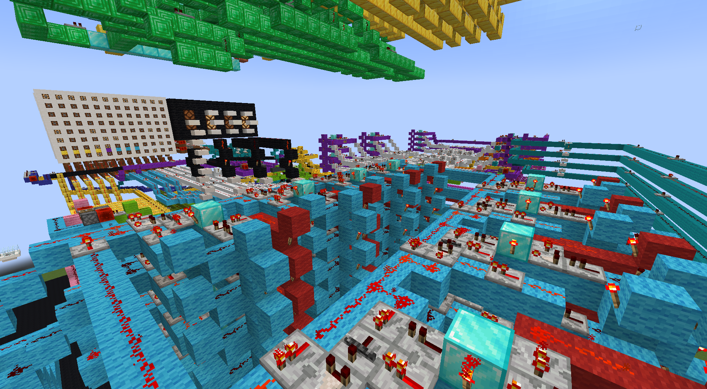

# HalvinPC
A (currently) 4 bit Minecraft computer.

## About
   
About this project.  

## Quick Start
Quickstart guide here.  

## Parts
The PC has multiple parts which are also available seperately. The following schematics are available:
- `parts/RAM_XX` - RAM modules.
- `parts/...` - ...

## Screenshots

Below are some screenshots of different angles. 
  
  
  
   
  More screenshots are available <a href="https://github.com/gideon-pol/HalvinPC/wiki/Screenshots">here</a>.

